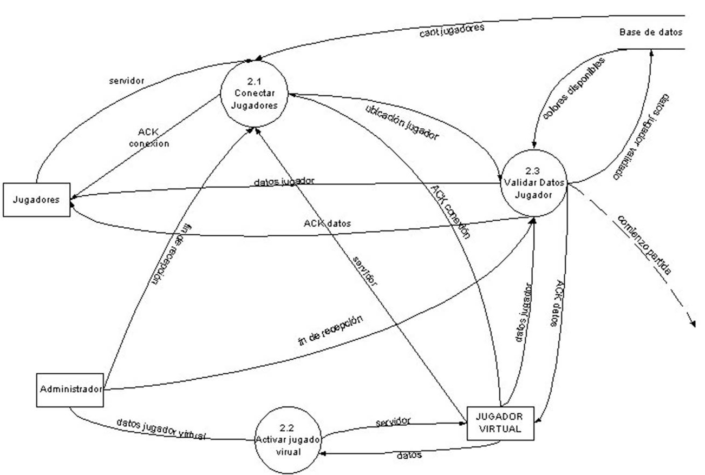
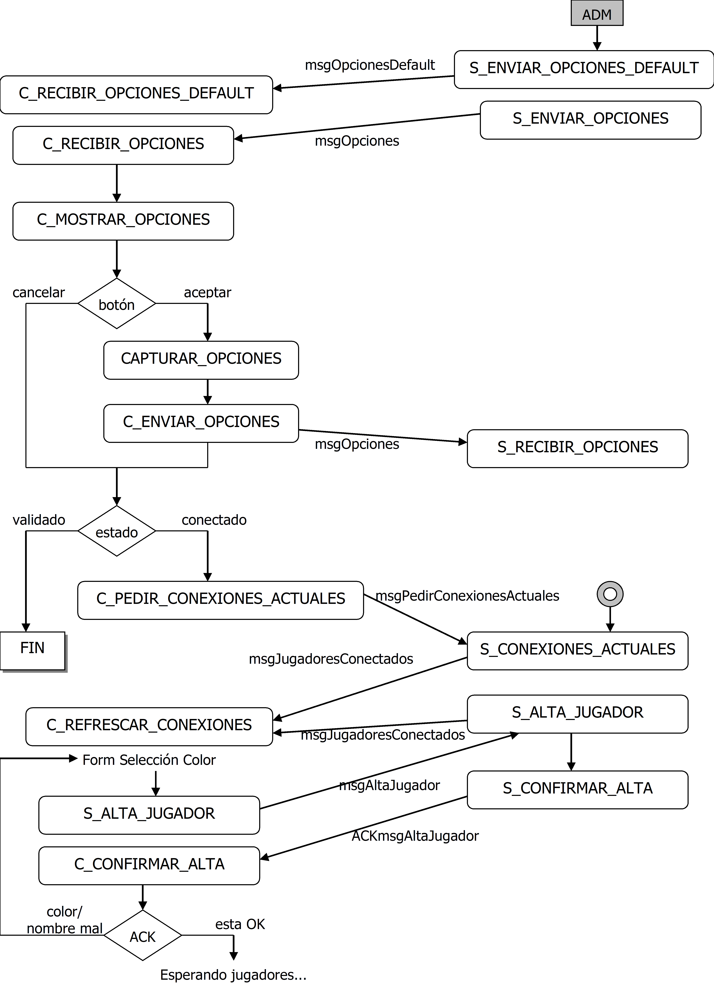
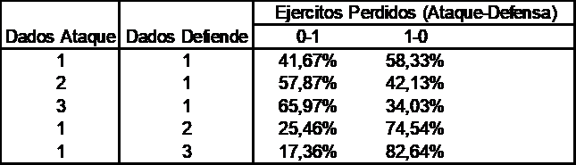

# Manual de Sistema - Especificaciones Técnicas

## ¿Qué es TegNet?

TEGNet es un juego de tácticas y estrategias de guerra basado en el conocido juego de mesa TEG. Respecto a este último, presenta dos grandes innovaciones:
1. La capacidad de permitir que distintas personas conectadas a una red de computadoras puedan jugar una partida, sin importar donde se encuentren, eliminando así las restricciones espaciales de la versión clásica.
1. La posibilidad de enfrentarse contra jugadores virtuales simulados por la computadora.
Alcance

El sistema brinda todo lo necesario para que una partida pueda llevarse a cabo. Esto abarca desde la inscripción de los participantes, al comienzo de la partida, hasta la finalización de la misma, donde uno de esos participantes (ya sea real o virtual) se imponga sobre el resto, logre terminar su misión y resulte ganador.

### Descripción

TEGNet propone un conflicto bélico que tiene lugar sobre un planisferio dividido en 50 países. Los países se reparten entre los jugadores, quienes ocupan sus dominios con ejércitos. Cada jugador tiene un objetivo secreto a cumplir, que se le asigna por azar y que los demás jugadores desconocen. Para cumplir con su objetivo el jugador deberá ampliar sus dominios y reordenar sus fuerzas, lo que exigirá emprender ataques y defenderse de ataques adversarios; agrupar y desplazar ejércitos; concertar pactos con otros contendientes.

### Objetivo

El objetivo es que varias computadoras (participantes del juego), puedan interconectarse simultáneamente entre sí utilizando una arquitectura Cliente-Servidor, y establecer una partida del juego.

TEGNet brinda la posibilidad de enfrentarse contra jugadores virtuales con inteligencia y misiones propias, de tal forma que sólo baste la participación de un único jugador humano para poder disfrutar de esta aventura.

TEGNet posee una consola, a modo de tablero, mediante la cual los distintos jugadores, ya sean reales o virtuales, pueden efectuar las movidas que crean necesarias y ver las de sus contrincantes.

TEGNet posee su propio protocolo de comunicación entre los clientes remotos y el servidor, de manera tal de facilitar la coordinación y seguimiento de las jugadas.


## Estructura Modular del Sistema


  

## Diseño Modular

El sistema está compuesto básicamente por dos grandes módulos: un módulo Cliente y otro Servidor. Cada uno de estos módulos está integrado a su vez por submódulos.

A continuación se detallan las funciones de estos últimos.

### Módulo Servidor

1. Funciones del modulo Administrador de la partida.
   * Dinámica del juego.
   * Mantener el estado actual.
   * Validar acciones de los clientes.

1. Base de Datos:
   * Datos de los clientes.
   * Estado actual de la partida.
   * Reglas del juego.
   * Reglas de acción.
   * Elementos del juego.
   * Disposición del mapa.

1. Funciones del modulo Servidor Chat:
   * Distribución de mensajes públicos y privados.

1. Funciones del modulo Interfaz con los Clientes:
   * Construcción, envío de mensajes a los clientes.
   * Recepción de mensajes de los clientes y distribución a los módulos correspondientes.
   * Validación de mensajes entrantes.
   * Establecimiento y mantenimiento de la conexión a los clientes.

### Módulo Cliente

1. Funciones del modulo Jugador Real:
   * Validar y ejecutar las acciones.
   * Mantener el estado actual.
   * Coordinación de las acciones.

1. Base de Datos:
   * Estado actual de la partida.
   * Reglas de acción.

1. Funciones del modulo Cliente Chat:
   * Envío y recepción de mensajes con el servidor.

1. Funciones del modulo Interfaz con el servidor:
   * Construcción y envío de mensajes al servidor.
   * Recepción de mensajes del servidor y distribución al modulo correspondiente.
   * Validación de mensajes entrantes.
   * Establecimiento y mantenimiento de la conexión con el servidor.

1. Funciones del modulo Jugador Virtual:
   * Ídem jugador Real.
   * Algoritmos de decisión.

1. Funciones del modulo Interfaz gráfica:
   * Interpretación de las acciones provenientes del usuario. 
   * Mostrar la información y el estado del juego. 
 

## Modelo Conceptual de Datos

### Diagrama Entidad-Relación


*  Entidades con información de las Partidas (Variable).
*  Entidades con información propia del Juego (No variable).
*  Entidades con información Mixta. Opciones por Defecto (No variables) y Opciones propias de cada Partida (Variables).


## Diseño Funcional del Sistema


### Diagrama de Contexto


### Diagrama de Flujo de Datos


 
#### Explosión Proceso 1 (Inicializar Partida)


 

#### Explosión Proceso 2 (Recibir Jugadores)


 

#### Explosión Proceso 3 (Ejecutar Chat)


 
#### Explosión Proceso 4 (Ejecutar Partida)


 
## Especificación de Procesos


A continuación se detallan los procesos más importantes del sistema.

> Nomenclatura: La primer letra del nombre de cada proceso indica si este se ejecuta en el Módulo Cliente o en el Servidor. De esta manera, aquellos procesos cuyo nombre comience con la letra **C** corresponden al Cliente y aquellos que comiencen con la letra **S** al servidor.


| Proceso: | C_CONECTAR_ADM |
| --- | --- |
| Activador: | Opción ADM |
| Input: | |	
| Función: | Levanta el servidor <br/>Conecta automáticamente al ADM con el servidor <br/>C_CONECTAR (localhost) |
| Output: | |	


| Proceso: | C_CONECTAR |
| --- | --- |
| Activador: | C_CONECTAR_ADM / Opción Jugador Normal |
| Input: | Dirección del servidor |	
| Función: | Establece una conexión con el servidor. |
| Output: | Índice de conexión |	


| Proceso: | S_CONFIRMAR_CONEXION |
| --- | --- |
| Activador: | C_CONECTAR |
| Input: | Dirección del servidor |	
| Función: | Valida que no se supere la cantidad máxima de jugadores (seis).<br/>Envía al cliente los colores disponibles y las conexiones anteriores. |
| Output: | Colores disponibles, Conexiones anteriores (nombre, color) |	


| Proceso: | C_ALTA_JUGADOR |
| --- | --- |
| Activador: | S_CONFIRMAR_CONEXIÓN + Opción Jugador |
| Input: | Colores disponibles, color seleccionado, nombre seleccionado |	
| Función: | Muestra los colores disponibles.<br/>Valida y envia al servidor el nombre y el color del jugador. |
| Output: | Color validado, nombre validado |	


| Proceso: | S_CONFIRMAR_ALTA (broadcast) |
| --- | --- |
| Activador: | C_ALTA_JUGADOR |
| Input: | Color validado, nombre validado |	
| Función: | Revalida el nombre y el color.<br/>Informa a los clientes ya conectados (nuevo inclusive) la nueva conexión.<br/>Da de alta el nuevo jugador en la base de datos. |
| Output: | Conexiones actuales (incluye la nueva) |	


| Proceso: | S_CONFIRMAR_BAJA (broadcast) |
| --- | --- |
| Activador: | Desconexión de un jugador |
| Input: | Índice de desconexión |	
| Función: | Da de baja al jugador en la base de datos.<br/>Informa a los clientes las conexiones actuales.<br/>Da de alta el nuevo jugador en la base de datos. |
| Output: | Conexiones actuales (sin la baja) |	


| Proceso: | C_REFRESCAR_CONEXIONES |
| --- | --- |
| Activador: | Conexiones actuales |
| Input: | Índice de desconexión |	
| Función: | Actualiza en el cliente las conexiones actuales. |
| Output: |  |	


| Proceso: | C_COMENZAR_RECEPCION |
| --- | --- |
| Activador: | Opción ADM |
| Input: | Inicialización OK |	
| Función: | Indica al servidor que puede comenzar a recibir conexiones de jugadores normales. |
| Output: | Indicación de Comienzo de Recepción |	


| Proceso: | S_COMENZAR_RECEPCION |
| --- | --- |
| Activador: | C_COMENZAR_RECEPCION |
| Input: | Indicación de Comienzo de Recepción |	
| Función: | Habilita en el servidor la posibilidad de recibir conexiones de jugadores normales. |
| Output: |  |	


| Proceso: | C_ACTIVAR_JUGADOR_VIRTUAL |
| --- | --- |
| Activador: | Opción ADM |
| Input: | Nombre del jugador |	
| Función: | Levanta el jugador virtual y le manda su nombre para que este se conecte luego al servidor. |
| Output: | Nombre del jugador |	


| Proceso: | C_FIN_RECEPCION |
| --- | --- |
| Activador: | Opción ADM |
| Input: | Indicación fin recepción |	
| Función: | Indica al servidor que finalice la recepción de jugadores. |
| Output: | Fin de la recepción |	


| Proceso: | S_COMENZAR_PARTIDA |
| --- | --- |
| Activador: | Fin de la recepción / Cupo agotado |
| Input: | Indicación fin recepción |	
| Función: | Finaliza la recepción.<br/>Comienza la partida.<br/>S_REPARTIR_PAISES<br/>S_REPARTIR_MISIONES<br/>S_ESTABLECER_RONDA<br/>S_SINCRONIZAR_JUGADOR (para cada jugador)<br/>S_ADMINISTRAR_RONDA |
| Output: |  |	


| Proceso: | S_SINCRONIZAR_JUGADOR |
| --- | --- |
| Activador: | S_COMENZAR_PARTIDA / C_PEDIR_SINCRONIZACION |
| Input: | Nombre jugador |	
| Función: | Tomar de la base de datos toda la información necesaria y enviársela al jugador especificado. |
| Output: | Mensajes de sincronización (ver detalle de mensajes) |	


| Proceso: | C_SINCRONIZAR_JUGADOR |
| --- | --- |
| Activador: | S_SINCRONIZAR_JUGADOR |
| Input: | Mensajes de sincronización (ver detalle de mensajes) |	
| Función: | Actualizar La interfaz y la base de datos del cliente, según lo recibido. |
| Output: |  |	


| Proceso: | S_ADMINISTRAR_RONDA |
| --- | --- |
| Activador: | S_COMENZAR_PARTIDA |
| Input: | Orden de la ronda |	
| Función: | Informa a los jugadores el turno actual.<br/><br/>S_CONTROLAR_MISIÓN (controla solo al jugador que termino su turno y solo en la rondas de Accion)<br/>Informa a los jugadores las tropas disponibles (en las rondas de Recuento)<br/>Si se cumple la Misión informa el ganador y finaliza el juego. |
| Output: | Mensajes: Comienzo Turno, Tropas Disponibles, Ganador |	


| Proceso: | S_CONTROLAR_MISION |
| --- | --- |
| Activador: | S_CONTROLAR_MISION |
| Input: | Color |	
| Función: | En base al color, toma de la base de datos la misión y el mapa, y chequea si el jugador cumplió o no su misión. |
| Output: | Indicación |	


| Proceso: | C_ADMINISTRAR_RONDA |
| --- | --- |
| Activador: | S_ADMINISTRAR_RONDA |
| Input: | Comienzo Turno |	
| Función: | Actualiza la interfaz del Cliente, en base a los turnos recibidos.<br/>Para el turno actual, maneja los botones de acción, según el tipo de turno (acción o recuento). |
| Output: |  |	


| Proceso: | C_AGREGAR_TROPAS |
| --- | --- |
| Activador: | Opción Jugador |
| Input: |  |	
| Función: | Realiza una validación preliminar: Chequea que el país sea propio, que tenga tropas disponibles y que el destino de las tropas sea válido (continente o país).<br/>No se queda esperando un ACK del servidor, solo le manda la petición. |
| Output: | Mensaje: Ubicación de Tropas (ver detalle de mensajes) |	


| Proceso: | S_AGREGAR_TROPAS |
| --- | --- |
| Activador: | C_AGREGAR_TROPAS |
| Input: | Mensaje: Ubicación de Tropas |	
| Función: | Valida la acción: en caso de error avisa al jugador, si esta OK avisa a todos los jugadores. |
| Output: | Mensaje: ACK Agregar, País (broadcast) |	


| Proceso: | C_ACTUALIZAR_INTERFAZ |
| --- | --- |
| Activador: |  |
| Input: |  |	
| Función: | Recibe los ACKs de las acciones e informa en caso de error.<br/>Actualiza la interfaz con los cambios recibidos del servidor.<br/>Si ante la respuesta de un Ataque (se reciben dos mensajes Pais) los dos paises tienen igual Color, es porque hubo una Conquista, entonces de le debe preguntar al Jugador cuantas fichas quiere pasar (C_CONQUISTA). |
| Output: |  |	


| Proceso: | C_ATACAR |
| --- | --- |
| Activador: | Opcion Jugador |
| Input: | País origen y destino |	
| Función: | Validación preliminar.<br/>No espera ACK ni actualiza la interfaz (la interfaz se actualiza de igual manera en todos los Jugadores) |
| Output: | Mensaje: Ataque (ver detalle de mensajes) |	


| Proceso: | S_ATACAR |
| --- | --- |
| Activador: | C_ATACAR |
| Input: | Mensaje: Ataque |	
| Función: | Valida el Ataque:<br/>o si hay error lo informa al jugador<br/>o si esta OK: tira los dados, recalcula las tropas de los países (según dados) e informa resultados.<br/>Si hay conquista, pasa una tropa al país conquistado, luego informa esto a todos los jugadores. Este ultimo mensaje será interpretado por el Cliente (ya que cambia el color del país atacado) quien le informará la conquista al jugador y le preguntará la cantidad de Tropas que quiere pasar. |
| Output: | Mensaje: ACK Ataque, 2 mensajes Pais |	


| Proceso: | C_CONQUISTA |
| --- | --- |
| Activador: | C_ACTUALIZAR_INTERFAZ |
| Input: | Pais desde, Pais hasta |	
| Función: | nforma al jugador la conquista y le pregunta la cantidad de tropas que desea pasar al país conquistado. |
| Output: | Conquista (ver detalle de mensajes) |	
 

## Comunicación Cliente-Servidor

### Diseño de los Mensajes

Cada mensaje constará básicamente de dos partes:


Cada mensaje tiene un código único que lo identifica. En la parte de datos, se encuentra la información que transporta el mensaje, separada en campos.

En base al código, estará definido en la base de datos del sistema, la cantidad de campos que contiene en su parte de datos.


El código del mensaje se encuentra precedido por un caracter que indica el comienzo del mensaje (“#”). A su vez, los distintos campos de datos, se encuentran separados entre si por medio de un separador de campos (“|”). La utilización de un delimitador entre campos permite que los mismos puedan tener longitudes variables.
Ejemplo de un mensaje código 12 con tres campos de datos:

````
#12|campo1|campo2|campo3|
````

De esta forma el código de mensaje identifica inequívocamente el mensaje y sus campos, pudiendo invocar a la función correspondiente para que procese la sus datos.
El código de mensaje + los campos son lo único que se necesita para que un mensaje pueda ser codificado por el emisor y decodificado por el receptor.

Por otro lado, los mensajes de asentimiento a los cuales nos referiremos con las letras ACK (acknowledge) están estructurados de la siguiente manera:


Los posibles tipos de ACK para cada código de mensaje, estarán  definidos en una tabla de la Base de Datos.

En el siguiente listado se muestran los mensajes de ACK pero se omite su contenido.

> Nota: Los mensajes resaltados en cursiva corresponden únicamente al cliente Administrador.
 
### Descripción de los Mensajes

#### Mensajes de Conexión

**_Color del Administrador_**
* Descripción: Selección de color del usuario Administrador
* Parámetros:
   * Id_color
* Tipo: CLIENTE → SERVIDOR

**ACK Color del Administrador**
* Descripción: Acuse de Recibo de Color seleccionado por el Cliente (Administrador)
* Tipo: SERVIDOR → CLIENTE

**_Nombre del Administrador_**
* Descripción: Nombre seleccionado por el Cliente (Administrador)
* Parámetros:
   * Nombre
* Tipo: CLIENTE → SERVIDOR

**ACK Nombre del Administrador**
* Descripción: Acuse de Recibo de Nombre seleccionado por el Administrador
* Tipo: SERVIDOR → CLIENTE

**Comienzo Recepción**
* Tipo: CLIENTE → SERVIDOR

**Opciones de configuración**
* Descripción: Selección de una de las posibles opciones de configuración
* Parámetros:
   * Id_opcion
   * Valor
* Tipo: CLIENTE → SERVIDOR

**Color del Jugador**
* Descripción: Selección del color del Cliente (Jugador)
* Parámetros:
   * Id_color
* Tipo: CLIENTE → SERVIDOR

**Nombre del Jugador**
* Descripción: Selección del nombre del Cliente (Jugador)
* Parámetros:
   * Nombre
* Tipo: CLIENTE → SERVIDOR

**Jugadores Conectados**
* Descripción: Nombre y Color de los jugadores conectados
* Parámetros:
   * Id_color
   * Nombre
* Tipo: SERVIDOR → CLIENTE

**Aviso nueva conexión**
* Descripción: Nombre y Color de los jugadores conectados
* Parámetros:
   * Id_color
   * Nombre
* Tipo: SERVIDOR → CLIENTE

#### Mensajes de Desconexión

**Aviso Desconexión**
* Descripción: Avisa que el Cliente se está desconectando
* Tipo: CLIENTE → SERVIDOR

**ACK Aviso Desconexión**
* Descripción: Acuse de Recibo de aviso de Desconexión
* Tipo: SERVIDOR → CLIENTE

**Pedido de Desconexión**
* Descripción: El Servidor le solicita a un Cliente la desconexión
* Parámetros:
   * Motivo
* Tipo: SERVIDOR → CLIENTE

**Respuesta Pedido de Desconexión**
* Descripción: Respuesta del Cliente a un pedido de Desconexión: Acepta/Cancela
* Parámetros:
  * Valor (acepta/no)
* Tipo: CLIENTE → SERVIDOR
	

#### Mensajes de Mantenimiento ####

**Mensaje de Error**
* Descripción: El Servidor notifica de un error al Cliente
* Parámetros:
   * Id_error
* Tipo: SERVIDOR → CLIENTE

**AYA (Are You Alive? )**
* Descripción: Usado antes de la sincronización para saber si el Cliente esta activo
* Tipo: SERVIDOR → CLIENTE

**Pedido de Resincronización**
* Descripción: El Cliente solicita envío de datos de Sincronización
* Parámetros:
   * Nombre
* Tipo: CLIENTE → SERVIDOR

**Msgs. de Resincronización**
* Descripción: Serie de mensajes que el Servidor envía al Cliente para que este pueda sincronizarse con el estado actual de la partida
* Parámetros:
   * Pais
   * Id_pais
   * Id_color
   * Cantidad
   * Misión Asignada (ver abajo)
   * Jugadores
   * Id_color
   * Nombre
   * Cant_tarjetas
   * Nro_canje
   * Orden ronda (ver abajo)
   * Tipo ronda (ver abajo)
   * Proporcionar tarjeta (ver abajo)
   * Turno actual
   * Id_color
   * Timer turno (solo para turno activo)
   * Timer
   * Tropas disponibles (ver abajo) (por si se reconecta durante su turno en una ronda “poner”)
   * Estado turno (para las rondas de “juego”)
   * Estado (A, M o T)
* Tipo: SERVIDOR → CLIENTE

**Noticia (broadcast)**
* Descripción: El Servidor informa a todos los Clientes (broadcast) de una Novedad en el juego
* Parámetros:
   * Dados
   * Valor_dado1
   * Valor_dado2
   * ...
   * Valor_dado6
   * Pais (ver arriba)
   * Tarjeta Jugador (ver abajo)
   * Canje
   * Id_color
   * Nro_canje
* Tipo: SERVIDOR → CLIENTE

#### Partida

**Orden Ronda (broadcast)**
* Descripción: El Servidor informa a todos los Clientes (broadcast) del órden en que deben jugar la ronda actual
* Parámetros:
   * Id_color1
   * Id_color2
   * …
   * Id_color6
* Tipo: SERVIDOR → CLIENTE

**Tipo Ronda (broadcast)**
* Descripción: El Servidor informa a todos los Clientes (broadcast) del tipo de ronda actual
* Parámetros:
   * Tipo (Poner / Jugar)
* Tipo: SERVIDOR → CLIENTE

**Reparto Países (broadcast)**
* Descripción: El Servidor informa a todos los Clientes (broadcast) como se reparten los países al inicio del juego
* Parámetros:
   * Id_color
   * Id_pais
* Tipo: SERVIDOR → CLIENTE

**Misión Asignada**
* Descripción: El Servidor informa al Cliente cuál es su misión asignada
* Parámetros:
   * Descripción
* Tipo: SERVIDOR → CLIENTE

**Tropas disponibles (broadcast)**
* Descripción: El Servidor informa a todos los Clientes (broadcast) cuántas tropas le corresponde a cada jugador en el turno
* Parámetros:
   * Id_color
   * Cantidad
   * Continente (por bonus)
   * Pais (por tarjeta)
* Tipo: SERVIDOR → CLIENTE

**Ubicación de Tropas**
* Descripción: El Cliente informa como dispondrá (país y cantidad) de sus tropas disponibles.
* Parámetros:
   * Id_pais
   * Cantidad
* Tipo: CLIENTE → SERVIDOR

**Movimiento de Tropas**
* Descripción: El Cliente informa cómo moverá sus tropas de un país a otro
* Parámetros:
   * Id_pais_origen
   * Id_pais_destino
   * Cantidad
* Tipo: CLIENTE → SERVIDOR

**Ataque**
* Descripción: El Cliente informa que realiza un ataque de un país a otro
* Parámetros:
   * Id_pais_desde
   * Id_pais_hasta
* Tipo: CLIENTE → SERVIDOR

**Conquista** 
* Descripción: Ídem Movimiento de Tropas
* Parámetros:
   * Id_pais_origen
   * Id_pais_destino
   * Cantidad
* Tipo: CLIENTE → SERVIDOR

**Tomar tarjeta**
* Descripción: Informa que el Cliente desea tomar una nueva Tarjeta
* Tipo: CLIENTE → SERVIDOR

**Proporcionar tarjeta**
* Descripción: El Servidor le informa al Cliente la tarjeta que le tocó (si tiene el país NO agrega 2 tropas automáticamente)
* Parámetros:
   * Id_pais
   * Id_figura
   * Cobrada (en la sincronización puede estar cobrada)
* Tipo: SERVIDOR → CLIENTE

**Tarjeta Jugador (broadcast)**
* Descripción: Informa a todos los Clientes (broadcast) la cantidad de tarjetas que tiene un jugador
* Parámetros:
   * Id_color
   * Cant_tarjetas
* Tipo: SERVIDOR → CLIENTE

**Usar Tarjeta**
* Descripción: El Cliente informa que desa usar una tarjeta
* Parámetros:
   * Id_tarjeta
* Tipo: CLIENTE → SERVIDOR

**Canje**
* Descripción: El Cliente informa que desea realizar un canje de 3 tarjetas por fichas.
* Parámetros:
   * Id_tarjeta1
   * Id_tarjeta2
   * Id_tarjeta3
* Tipo: CLIENTE → SERVIDOR

**Comienzo Turno (Broadcast)**
* Descripción: Avisa a todos los Clientes (broadcast) que ha comenzado un nuevo turno, indicando cual es el jugador que comienza
* Parámetros:
   * Id_color
* Tipo: SERVIDOR → CLIENTE

**Fin Turno**
* Descripción: El Cliente informa que desea finalizar su turno
* Tipo: CLIENTE → SERVIDOR

**Expiración Turno**
* Descripción: El Servidor avisa al Cliente que su turno ha expirado
* Tipo: SERVIDOR → CLIENTE

**Ganador (broadcast)**
* Descripción: El Servidor avisa a todos los Clientes que un jugador ha ganado la partida, anunciando el fin del juego.
* Parámetros:
   * Id_color
* Tipo: SERVIDOR → CLIENTE

#### Chat

**Envío Mensaje**
* Descripción: El Cliente envía un mensaje al Chat
* Parámetros:
   * Mensaje
* Tipo: CLIENTE → SERVIDOR

**Msg. Saliente (broadcast)**
* Descripción: El Servidor envía el mensaje a todos los Clientes (broadcast)
* Parámetros:
   * Id_color (del Jugador que envía el mensaje)
   * Mensaje
* Tipo: SERVIDOR → CLIENTE


## Procesos del Sistema y Diálogo Cliente-Servidor

### Organización de la Partida





### Cambio de Administrador de la Partida

````
Menu Administración
> Cambiar Administrador
````


### Inicio de la Partida


 
### Fin de Turno


### Agregar Tropas


### Ataque


### Mover Tropas


### Tomar Tarjeta


## Resincronización


## Jugador Virtual

### Introducción

Se entiende por Jugador Virtual a aquel jugador de TEGNet que es conducido por la computadora. El usuario solo deberá interactuar con él para definir sus características.

El Jugador Virtual será capaz, entonces, de realizar toda la dinámica del juego sin la intervención del usuario, desde la conexión hasta la finalización de la partida y posterior desconexión. Adicionalmente, el usuario podrá desconectar al Jugador Virtual en cualquier momento de la partida, así como también podrá volver a conectarlo sin que ello implique una modificación en la dinámica del juego.

### Análisis General

Los jugadores virtuales deberán simular el comportamiento de los jugadores reales, contra los cuales deberán enfrentarse e intentar derrotar.

Al igual que el resto de los participantes, los jugadores virtuales deberán ser capaces de “pensar” por si mismos y tomar decisiones (lo mas acertadas posibles) a la hora de jugar.

A lo largo del juego existirán **tres momentos claves** donde se requerirá que los jugadores virtuales sean inteligentes:

1. En el momento de Atacar.
1. En el momento de Agregar Tropas.
1. En el momento de Mover Tropas.

A continuación se describe la forma de proceder que tendrán los jugadores virtuales en cada uno de los tres momentos del juego mencionados anteriormente.

#### Atacar

Llegado el momento de Atacar, el jugador virtual evaluará por separado cada uno de los posibles ataques. Para ello contará con una función, la cual le brindará un puntaje determinado para un posible ataque. Cuanto mayor sea su puntaje, mas conveniente será efectuar dicho ataque.

Cada ataque estará definido por una combinación de dos países, atacante y atacado, donde el primero deberá pertenecer al jugador virtual y el segundo no. Una vez evaluados todos los posibles ataques, se tomará el de mayor puntaje y se comparará con el Umbral de Decisión del jugador virtual; si este puntaje supera dicho Umbral, el ataque será llevado a cabo.

El Umbral de Decisión del jugador virtual, determinará su postura frente al ataque, y definirá su nivel de agresividad:

* Cuanto menor sea el Umbral, su comportamiento será mas agresivo.
* Cuanto mayor sea el Umbral, su comportamiento será mas conservador.

Dicho Umbral de decisión estará dentro del rango de valores asignados al ataque, y podrá variar con el tiempo. Por ejemplo, si es el primer ataque del turno, el Umbral será mas bajo de lo normal ya que es necesario realizar al menos un ataque para poder tomar tarjeta.
Una vez realizado un ataque se evaluarán nuevamente todos los posibles ataques, se tomará el de mayor puntaje y se comparará con el Umbral de Decisión.

Este proceso se repetirá dando lugar a una serie de ataques (los cuales era conveniente realizar), hasta que no exista ningún ataque cuyo puntaje supere el Umbral de decisión.

Ahora bien, lo mas dificultoso de todo este procedimiento es calcular el puntaje que le corresponde a cada Ataque. Dicho puntaje está definido por un amplio conjunto de variables, denominadas Heurísticas, a tener en cuenta, como ser:
* La probabilidad de ganar el Ataque, según la cantidad de tropas de cada país.
* Si el país a atacar corresponde a la misión del jugador virtual (esto incrementará su puntaje ya que su conquista ayuda a cumplir la misión)
* Si el país a atacar es el último país de un continente (esto incrementará su puntaje ya que su conquista permitiría cobrar un bonus por poseer un continente).
* Si el jugador virtual posee la tarjeta del país a atacar (esto incrementa su puntaje, ya que el hecho de tener la tarjeta del país a atacar permite agregarle dos tropas si se llega a conquistar)
* Posibles contraataques (disminuye su puntaje)

Si luego del ataque, el jugador virtual conquista el país, deberá decidir cuantas tropas mover al país conquistado (entre 1 y 3). Para ello utilizará el mismo procedimiento que para [mover tropas](#mover-tropas).

#### Agregar Tropas

Tanto al comienzo del juego (primeras dos rondas) como en cada una de las rondas de Recuento, el jugador virtual deberá decidir en que países colocará las tropas que tiene disponibles. Para ello procederá de la siguiente manera:
* Sin importar la cantidad de tropas que tenga disponibles para agregar, el jugador virtual tomará de a una tropa y evaluará por medio de una función especial cada uno de sus países. Esta función arrojará un determinado puntaje para cada país, luego el país con mayor puntaje será donde se ubicará la tropa.
* Este proceso deberá repetirse hasta agotar la cantidad de tropas disponibles.
* El puntaje otorgado por la función a cada país será calculado teniendo en cuenta distintas variables, como ser:
   * Si el país tiene limítrofes enemigos o no.
   * Cantidad de tropas que contiene el país.
   * Si el país pertenece a la misión.
   * Si el país es el único restante de un continente e impide que sea conquistado totalmente por otro jugador.

#### Mover Tropas

Finalizados los ataques, el jugador virtual debe decidir si mueve o no algunas tropas (reagrupamiento). En este caso, su manera de proceder será la siguiente:
1. En primer lugar identificará todas las tropas que puede mover (países con mas de una tropa y algún limítrofe aliado).
1. Luego tomará de a una las posibles tropas a mover, la retirará de su país y aplicará el mismo razonamiento utilizado en el momento de [Agregar tropas](#agregar-tropas) pero solo entre el país de donde se retiró la tropa y sus países limítrofes aliados.

De esta manera puede ser que la tropa sea ubicada en un país limítrofe o en el mismo país de donde se retiró, en este último caso la tropa no sufrirá movimiento alguno.

Luego de cada movimiento, la tropa analizada debería ser marcada de alguna manera para así evitar que se mueva mas de una vez una misma tropa.
 
### Estructura General del Jugador Virtual

Realizado el Análisis General de la lógica del jugador virtual se pasa a detallar de que manera está implementado.

El Jugador Virtual está compuesto básicamente por 4 módulos:


1. El módulo **Interfase** es el encargado de realizar las funciones de comunicación con el Servidor TEGNet y es exactamente igual que el módulo del mismo nombre descrito en la sección del Jugador Real.
1. El módulo **Autómata** es básicamente una máquina de estados que realiza toda la dinámica del juego, es decir, es quién conoce las Reglas del Juego y quién decide las acciones a seguir.
1. El módulo de **Inteligencia Artificial** tiene como tarea la toma de decisiones en base a lo que le ordena el Autómata. A través de las Heurísticas definidas y la información del tablero y asistido por el módulo de Probabilidades y Estadísticas es quién transforma en acción la orden emitida por el autómata.
1. El módulo de **Probabilidades y Estadísticas** tiene como objetivo resolver en forma eficiente los problemas probabilísticos planteados por el módulo de Inteligencia Artificial.
 
En la siguiente figura se muestra en forma genérica la estructura del Jugador Virtual.


La función Efectuar Acción se activa al llegar un mensaje proveniente del Servidor. Esta función de control, que forma parte del Autómata (junto con la función de Actualizar Estado) es quién dispara las acciones a seguir de acuerdo al tipo de mensaje y al estado en que se encuentre. Cada una de las funciones disparadas por Efectuar Acción, pertenecientes al módulo de Inteligencia Artificial, realizan su función correspondiente (cada función se analizará en detalle mas adelante), llamando a la función que corresponda del módulo Interfase, y si detectan que no pueden realizar la acción, disparan la función siguiente. El proceso de Actualizar Estado es el encargado de mantener el estado del Jugador Virtual durante toda la partida.

### Autómata

Este módulo es el encargado de llevar la lógica de la partida desde la conexión hasta la finalización de la misma y la eventual reconexión. Es quién decide que acción tomar en respuesta a los mensajes enviados por el Servidor.

Para cumplir dicha tarea cuenta con una Máquina de Estados similar a la utilizada por el Jugador Real para hacer las validaciones. De acuerdo al Estado en que se encuentre la partida ejecutará las funciones de Inteligencia Artificial pertinentes.

En caso de producirse algún tipo de error (un Estado inconsistente) deberá resincronizarse para subsanarlo y seguir adelante. El jugador virtual no puede cancelarse si se pierde un mensaje o llega un mensaje erróneo.

Para la representación de la máquina de estados se utiliza una matriz de estados y un Grafo. Los distintos estados están representados en las filas de la matriz de estados y en las burbujas o nodos del Grafo. Los eventos (que modifican los estados) están representados en las columnas de la matriz de estados y como los arcos del grafo.


La intersección entre una fila (x) y una columna (y) de la matriz de estados es el estado resultante de la llegada del evento ‘y’ en el estado ‘x’. El estado 99 (no representado por simplicidad del dibujo en el Grafo) es el denominado Inconsistente. La llegada a este estado solo puede producirse por la pérdida de algún mensaje o por una falla en el servidor o en el mismo jugador virtual. El autómata deberá, en este caso, resincronizar la jugada para reestablecer el estado y poder continuar con la partida.


El siguiente esquema simboliza el proceso que realiza el autómata para una ronda de Acción.


Al llegar de la interfase el mensaje de inicio de turno al proceso Efectuar Acción, se invoca a la función ``v_Atacar``, quien evalúa (a través del módulo de I.A. no representado en el esquema) si existen ataques posibles, si evalúa que si, se invoca a la función ``c_Atacar`` quien envía, por intermedio de la interfaz el mensaje de ataque al servidor. El servidor contesta con un ACK de Ataque que es recibido en ultima instancia por la rutina Efectuar Acción. De acuerdo al estado en que se encuentra determina que tiene que volver a invocar a la función ``v_Atacar`` nuevamente. El proceso se repetirá hasta que ``v_Atacar`` no encuentre mas enemigos potenciales para atacar y pasará automáticamente el control a la función ``v_Mover``, que realizará una acción similar. Al recibir ahora el mensaje de ACK de movimiento del servidor, la rutina Efectuar Acción cambiará de estado (ver Matriz de Estados) y volverá a invocar a la función ``v_Mover``. La ronda finalizará cuando el jugador virtual no tenga mas tarjetas que cambiar y pase el turno.

### Inteligencia Artificial

Este módulo se encarga, a nivel general, de la definición de la estrategia a seguir por el jugador virtual. Es el que decide qué país atacar, dónde poner las fichas, qué tarjetas canjear, como mover las tropas, etc.

Está compuesto básicamente por 6 funciones: ``v_Atacar``, ``v_Mover``, ``v_Tomar_Tarjeta``, ``v_Cobrar_Tarjeta``, ``v_Agregar`` y ``v_Canjear_Tarjeta`` que corresponden a cada uno de los momentos en los cuales el jugador virtual tiene que tomar decisiones con inteligencia.
Para la toma de decisiones el módulo de inteligencia artificial cuenta con las Heurísticas, la información del tablero y el módulo de Probabilidad y Estadística.

Las heurísticas se representan como números en el tablero, es decir, a cada país se le asigna un puntaje de acuerdo a las heurísticas definidas, y ese puntaje es utilizado luego para la toma de decisiones.
Las heurísticas tomadas para esta versión del jugador virtual son las siguientes:

1. Si el país a considerar forma parte de la misión, ese país cobra importancia, y mayor será su importancia cuanto mas cerca se encuentre de concluir la misma. Para el cálculo del valor asignado a un país por formar parte de la misión se utiliza la siguiente fórmula: 

   <code>
   V = P<sup>2</sup> x K<sub>M</sub>
   </code>


   Donde ``V`` es el valor que se le asigna al país en cuestión, ``P`` es el porcentaje completado de la misión y <code>K<sub>M</sub></code> una constante que define la importancia de la misión dentro de la mezcla de variables a utilizarse para el cálculo del puntaje de un país.

   

1. Si el país a considerar sirve para la conquista de un continente. Para este caso es obvio que todos los países pertenecen a algún continente y por lo tanto sirven para su conquista, pero mas importantes serán los países que pertenezcan a un continente a punto de ser conquistado y que el bonus por ese continente sea alto. La fórmula para el cálculo del valor del país por pertenecer a un continente se obtiene de:

   <code>
   V = P<sup>2</sup> x K<sub>C</sub> x B
   </code>

   En este caso intervienen dos variables, el porcentaje completado del continente (``P``) y el bonus asignado a ese continente (``B``). <code>K<sub>C</sub></code> es la constante que representa la importancia de esta variable con respecto a las demás.

   

1. Si se dispone de una tarjeta no cobrada de ese país. En este caso el cálculo es simplemente la constante que representa el tener una tarjeta no cobrada dentro de la mezcla de variables.

   <code>
   V = K<sub>T</sub>
   </code>

Con esta forma se puede mejorar la inteligencia del jugador agregando nuevas heurísticas al cálculo del puntaje del jugador virtual y se puede cambiar las características del jugador modificando la mezcla de variables.

El valor de cada país se calcula cada vez que se modifican las condiciones del mapa.

Explicada la forma en que se ponderan los países se pasará a explicar de que manera se realizan las funciones de inteligencia artificial.

#### Ataque

Para efectuar el ataque se utiliza un algoritmo que devuelve la tupla (País Origen, Destino) con su correspondiente valor. Se define una variable llamada **Umbral de Decisión** que define el mínimo valor considerado conveniente para realizar el ataque, si el valor devuelto por el algoritmo no supera dicho umbral se supone que no existen mas países a atacar y se devuelve el control al Autómata. El valor del Umbral es configurado por el Administrador de la partida al inicio del juego bajo el nombre de Agresividad (será mas agresivo cuanto menor sea su Umbral).
Para obtener la mejor tupla, el algoritmo obtiene todas las tuplas posibles (las que el país de origen sea del jugador y posea mas de una tropa y que el país destino no sea del jugador) y para cada una de ellas calcula la Esperanza Matemática (``E``), es decir, el valor que tiene el país a conquistar multiplicado por la probabilidad de conquistar dicho país. Aquella tupla que tenga el ``E`` mayor será la que será devuelta.

#### Poner Tropas

Para agregar tropas se utiliza una técnica similar a la del ataque, mientras existan tropas disponibles se llama a un algoritmo que devuelve el país donde es mas conveniente agregar una tropa (se agrega de a una tropa). Cuando no existen mas tropas disponibles se pasa el control al Autómata.

El algoritmo obtiene en primer lugar una lista de todos los potenciales países donde agregar tropas (todos los países del jugador). Para cada país se obtienen dos valores. Uno, denominado **Oportunidad**, que representa la oportunidad de conquistar uno o mas países limítrofes y se calcula en base al puntaje de cada país limítrofe enemigo. El otro valor utilizado es el **Riesgo**, que representa la posibilidad de perder el país en manos de los enemigos limítrofes y se calcula en base al puntaje del país en cuestión. La mezcla entre el Riego y la Oportunidad se realiza a través de una variable denominada **Actitud** que es configurable por el usuario que activa al jugador virtual. El país que obtenga el mayor valor ``Riesgo - Oportunidad`` será el elegido para poner la ficha.


#### Mover Tropas

Para realizar el movimiento de las tropas se identifican, en primer lugar, todas las tropas que se pueden mover (países con mas de una tropa y con algún limítrofe aliado).

Luego tomará de a una las posibles tropas a mover, la retirará de su país y aplicará el mismo algoritmo utilizado en el momento de Agregar tropas pero solo entre el país de donde se retiró la tropa y sus países limítrofes aliados.

De esta manera puede ser que la tropa sea ubicada en un país limítrofe o en el mismo país de donde se retiró, en este último caso la tropa no sufrirá movimiento alguno.

Luego de cada movimiento, la tropa analizada se marca para evitar que se mueva mas de una vez.

#### Tomar Tarjeta

Si se conquistó al menos un país durante el turno, entonces se dará la orden de tomar una tarjeta. Esto solo se realiza una vez por turno, por lo tanto luego de analizar la toma de tarjetas se devuelve el control al Autómata.

Para el análisis se mantiene un *Flag* que indica si durante la ronda se conquistó al menos un país.

#### Cobrar Tarjeta

El algoritmo recorre todas las tarjetas que aún no han sido cobradas y verifica con la información obtenida del tablero si puede hacerlo. 
El algoritmo se ejecutará tantas veces como tarjetas tenga para cobrar, luego se devuelve el control al Autómata para que pase el turno.

#### Canjear Tarjeta

El algoritmo utilizado par el Canje de Tarjetas arma todos los conjuntos de tres tarjetas posibles para hacer un canje (tres tarjetas iguales o tres distintas) y les asigna un puntaje, el conjunto con mayor puntaje será el candidato al canje. Si no encuentra ningún canje posible se devuelve el control al autómata para que continúe agregando tropas.

Las heurísticas para el cálculo del puntaje toman en cuenta si la tarjeta fue o no cobrada (una tarjeta que no se cobró tendrá un puntaje menor que una ya cobrada) y si la tarjeta es o no un comodín (los comodines tendrán un valor menor que las que no sean).

### Probabilidad y Estadística

Este modulo es el encargado de resolver el cálculo de la probabilidad de conquistar un país en función de las tropas con las que se ataca y con las que se defiende. Para la resolución de este problema se utilizarán métodos probabilísticos así como estadísticos.

Debido a la falta de una función probabilística general que resuelva el problema, el sistema debe encargarse por si solo de realizar el cálculo cada vez que sea necesario.

Se define como **Combate** a cada vez que se tiran los dados y **Batalla** a las sucesión de combates que llegan a un término.
Para el estudio del problema se utiliza un árbol como el de la figura. 


En donde cada nodo indica la cantidad de ejércitos (``ataque – defensa``) y cada nivel representa las distintas situaciones que pueden darse después de un combate en el estado inicial representado por el nivel inmediato superior. Cada uno de los posibles resultados tiene una probabilidad asociada (en el gráfico <code>P<sub>XY</sub></code>) que se calcula por medio de la siguiente tabla:

**Cuando hay 1 ficha en juego:**




**Cuando hay 2 fichas en juego:**


**Cuando hay 3 fichas en juego:**


Cada hoja del árbol es un estado final, o sea, una victoria o una derrota. Para calcular la probabilidad de llegar a ese estado hay que multiplicar la probabilidad de cada uno de los estados intermedios (en el árbol de ejemplo, el trazo en negrita, seria: ``P04 x P16 x P26``), es decir es la representación matemática de la probabilidad de llegar a cada uno de los estados intermedios. Si lo que se pretende calcular es la probabilidad de ganar una Batalla, habrá que sumar cada una de las probabilidades de llegar a un nodo hoja que signifique una batalla, es decir, que es la representación matemática de haber alcanzado cualquiera de los nodos que signifiquen una victoria. Con este método el cálculo de la probabilidad se resuelve a través de la **Probabilidad Total**.

Para la implementación se utilizó una función recursiva que recorre el árbol resolviendo cada nodo.

El problema de este método es que el tiempo de resolución aumenta exponencialmente con la cantidad de tropas en juego, al tiempo que carece de importancia un cálculo tan preciso de la probabilidad para tales cantidades.

Por tal motivo se ideó un método para estimar la probabilidad que reduce escalonadamente la cantidad de tropas en juego, hasta reducirlas a un número calculable. Dado que se pueden estimar la cantidad de tropas perdidas en cada combate (a través del cálculo de la media estadística), tanto para el que ataca como para el que se defiende, se van restando esos números a las cantidades originales hasta lograr cantidades calculables. 

El objetivo de este método es en definitiva encontrar tuplas (tropas de Ataque, tropas de Defensa) equivalentes y de esa manera estimar de la mejor forma posible situaciones con grandes cantidades de tropas en juego.

La media de un combate de tres dados contra tres dados es de: **1,9 tropas perdidas para el que ataca** y **1,1 tropas perdidas para el que defiende**.
 
## Estados y Controles del Cliente y Servidor

Al igual que el jugador virtual, el cliente real y el servidor poseen cada uno una máquina de estados con el objetivo fundamental de validar las acciones.

### Estados del Servidor:


 
### Estados del Cliente


### Controles del Cliente

El cliente posee, adicionalmente una matriz de controles que indica para cada estado cuales controles estarán habilitados y cuales no, de manera que cada vez que se cambie un estado se actualizan todos los controles.


